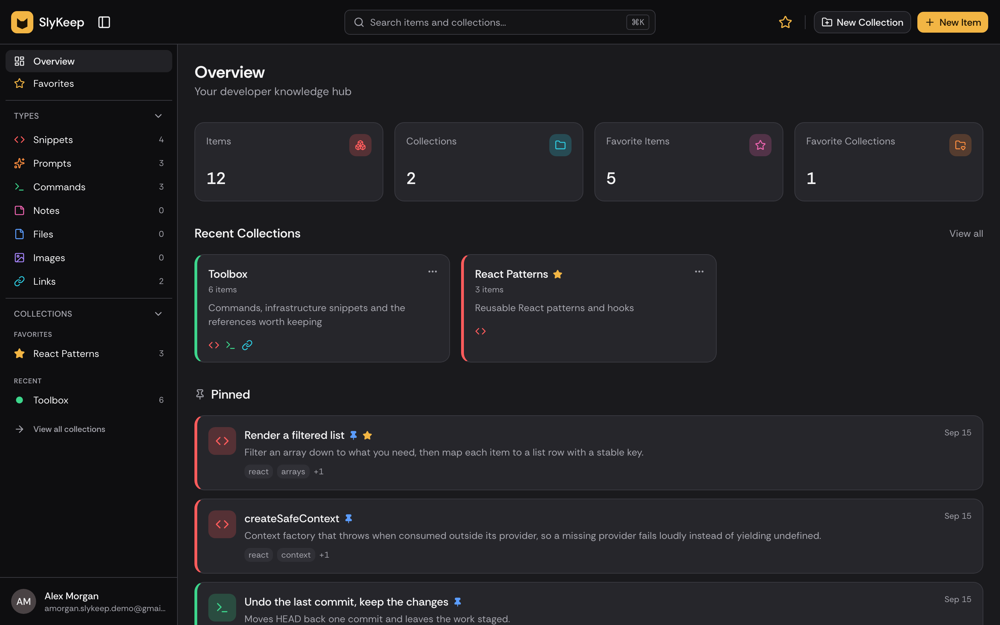
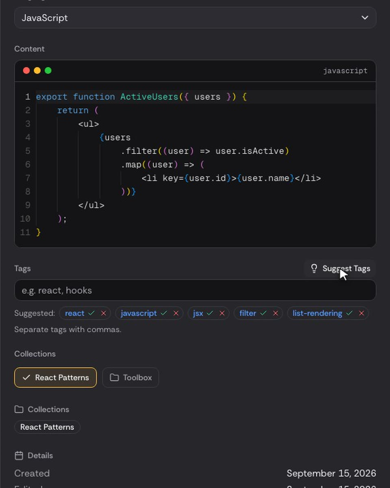
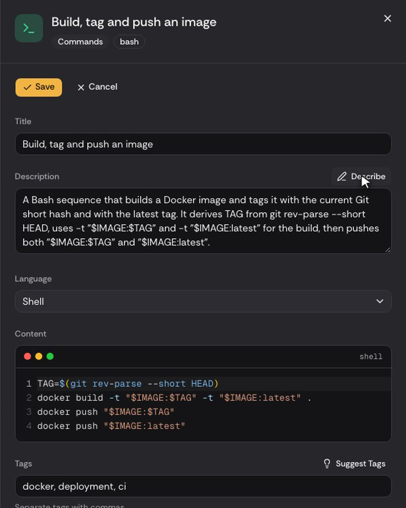
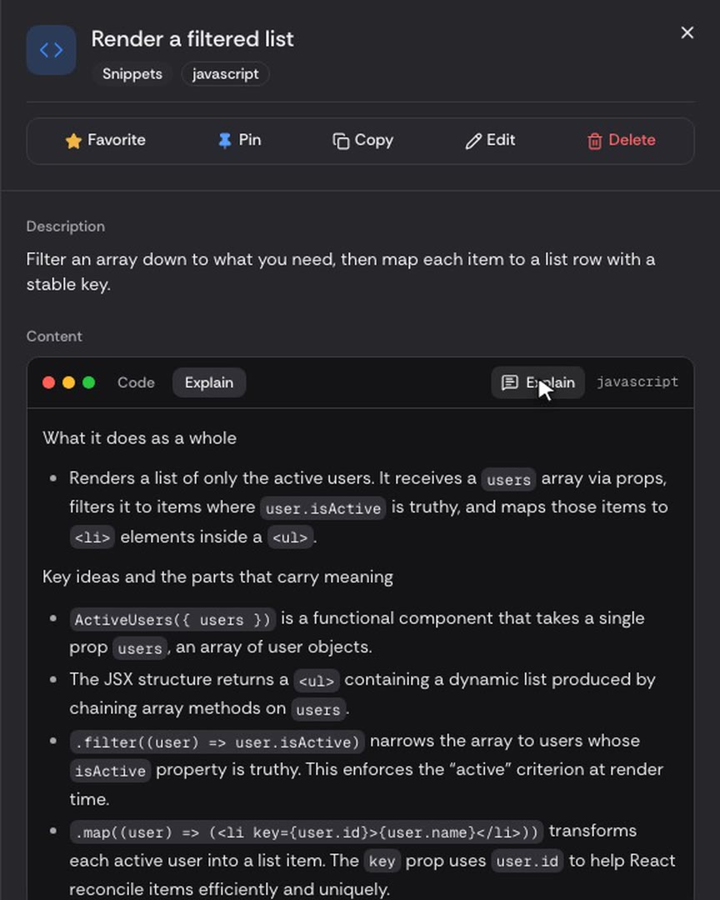
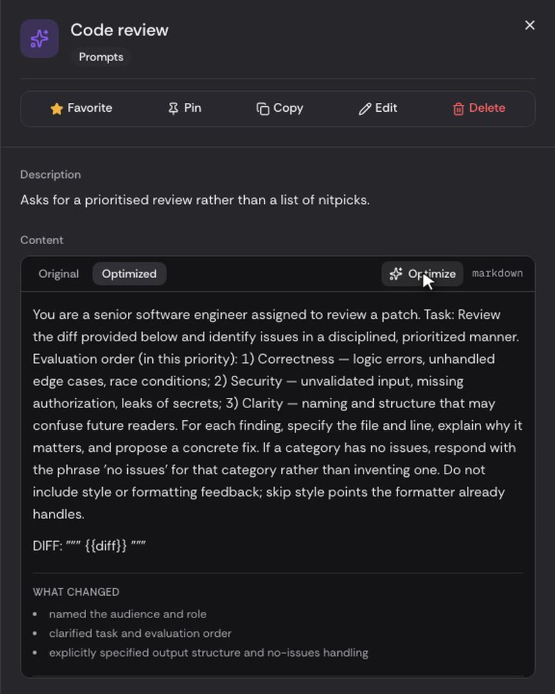

<div align="center">

# SlyKeep

**The knowledge hub for developers.**

Snippets, prompts, commands, notes, links and files — organized, searchable and AI-assisted.

[Live Demo](https://slykeep.com) · [Features](#features) · [Tech Stack](#tech-stack) ·
[Getting Started](#getting-started)


<br />

[](https://slykeep.com)

</div>

## Overview

SlyKeep brings the snippets, prompts, commands, notes, links and files developers rely on into a
single workspace. Everything is searchable from one command palette, grouped into collections, and
organized with the help of AI.

## Features

### Organization

- Seven item types: snippets, prompts, commands, notes, links, files and images
- Collections that group items of any type, with each item in as many collections as needed
- Tags, favorites and pinned items
- Code editor with syntax highlighting, and Markdown rendering for notes
- File and image uploads with inline preview

### Search

- Command palette (<kbd>⌘</kbd> <kbd>K</kbd> / <kbd>Ctrl</kbd> <kbd>K</kbd>) across titles,
  descriptions, tags, types and collections

### AI Assistance

- **Auto-tagging** — tag suggestions generated from an item's content
- **Summaries** — one-line descriptions for long notes and snippets
- **Code explanation** — plain-English walkthroughs of saved code
- **Prompt optimizer** — clearer, more effective versions of saved prompts

### Accounts & Billing

- Email and password or GitHub sign-in
- Email verification and password reset
- Subscriptions and self-service billing through Stripe

## Plans

|                      | Free    | Pro                   |
| -------------------- | ------- | --------------------- |
| Items                | 50      | Unlimited             |
| Collections          | 3       | Unlimited             |
| Item types           | 5       | All 7                 |
| File & image uploads | —       | ✓                     |
| AI features          | —       | ✓                     |
| Price                | $0      | $8/month or $72/year  |

## Screenshots

<table>
  <tr>
    <td width="50%"></td>
    <td width="50%"></td>
  </tr>
  <tr>
    <td align="center"><b>Auto-tagging</b></td>
    <td align="center"><b>Summaries</b></td>
  </tr>
  <tr>
    <td width="50%"></td>
    <td width="50%"></td>
  </tr>
  <tr>
    <td align="center"><b>Code explanation</b></td>
    <td align="center"><b>Prompt optimizer</b></td>
  </tr>
</table>

## Tech Stack

| Area          | Technology                                     |
| ------------- | ---------------------------------------------- |
| Framework     | Next.js 16 (App Router), React 19, TypeScript  |
| Styling       | Tailwind CSS v4, shadcn/ui                     |
| Database      | PostgreSQL (Neon), Prisma 7                    |
| Auth          | Auth.js — credentials and GitHub OAuth         |
| Payments      | Stripe                                         |
| File storage  | Cloudflare R2                                  |
| AI            | OpenAI GPT-5 nano                              |
| Email         | Resend                                         |
| Rate limiting | Upstash Redis                                  |
| Editor        | Monaco                                         |
| Validation    | Zod                                            |
| Testing       | Vitest                                         |
| Hosting       | Vercel                                         |

## Architecture

- **Server-only data layer** — database access and service clients are isolated behind
  `server-only` modules; components receive view models, never database records.
- **Deny-by-default routing** — every route requires authentication unless explicitly marked public.
- **Private file storage** — uploads are validated on the server and served only to their owner.
- **Webhook-driven billing** — subscription state is kept in sync with Stripe through webhooks.
- **Clean account deletion** — billing status is confirmed with Stripe and all stored files are
  removed.
- **Integration-tested** — billing and storage are tested against live Stripe (test mode) and R2,
  alongside the unit test suite.

## Getting Started

### Prerequisites

- Node.js 20+
- PostgreSQL database

### Installation

```bash
git clone https://github.com/tom-liron/slykeep.git
cd slykeep
npm install
cp .env.example .env
npm run db:migrate
npm run db:seed
npm run dev
```

The app runs at [http://localhost:3000](http://localhost:3000).

### Environment Variables

Required:

| Variable       | Description                                  |
| -------------- | -------------------------------------------- |
| `DATABASE_URL` | Pooled PostgreSQL connection string          |
| `DIRECT_URL`   | Direct PostgreSQL connection for migrations  |
| `AUTH_SECRET`  | Session secret — generate with `npx auth secret` |
| `AUTH_URL`     | Application base URL                         |

Optional, per feature:

| Feature        | Variables                                                                                         |
| -------------- | ------------------------------------------------------------------------------------------------- |
| GitHub sign-in | `AUTH_GITHUB_ID`, `AUTH_GITHUB_SECRET`                                                            |
| Email          | `RESEND_API_KEY`, `EMAIL_FROM`                                                                    |
| File storage   | `R2_ACCOUNT_ID`, `R2_ACCESS_KEY_ID`, `R2_SECRET_ACCESS_KEY`, `R2_BUCKET_NAME`                     |
| Billing        | `STRIPE_SECRET_KEY`, `STRIPE_WEBHOOK_SECRET`, `STRIPE_PRICE_ID_MONTHLY`, `STRIPE_PRICE_ID_YEARLY` |
| AI             | `OPENAI_API_KEY`                                                                                  |
| Rate limiting  | `UPSTASH_REDIS_REST_URL`, `UPSTASH_REDIS_REST_TOKEN`                                              |
| Cron jobs      | `CRON_SECRET`                                                                                     |

See [`.env.example`](.env.example) for the full list.

## Scripts

| Command               | Description                                  |
| --------------------- | -------------------------------------------- |
| `npm run dev`         | Start the development server                 |
| `npm run build`       | Build for production                         |
| `npm start`           | Start the production server                  |
| `npm run lint`        | Run ESLint                                   |
| `npm test`            | Run unit tests                               |
| `npm run db:migrate`  | Create and apply a development migration     |
| `npm run db:deploy`   | Apply migrations in production               |
| `npm run db:seed`     | Seed the database                            |
| `npm run db:studio`   | Open Prisma Studio                           |
| `npm run user:verify` | Mark a local account as email-verified       |

## Testing

```bash
npm test               # unit tests
npm run billing:test   # Stripe integration (requires a test-mode key)
npm run r2:test        # Cloudflare R2 integration
```

## Project Structure

```
src/
├── app/          # Routes and API handlers
├── actions/      # Server Actions
├── components/   # UI components
├── config/       # Product configuration
├── hooks/        # Client hooks
├── lib/          # Shared utilities and schemas
├── server/       # Server-only queries and service clients
└── types/        # Shared types
prisma/           # Schema, migrations and seed data
scripts/          # Maintenance scripts
```

## Deployment

SlyKeep is deployed on [Vercel](https://vercel.com). Apply database migrations with
`npm run db:deploy`, and configure scheduled jobs in [`vercel.json`](vercel.json).

## Documentation

- [Project overview](context/project-overview.md)
- [Design decisions](context/decisions.md)
- [Coding standards](context/coding-standards.md)
- [Feature history](context/feature-history.md)

## License

Copyright © 2026 Tom Liron. All rights reserved.
